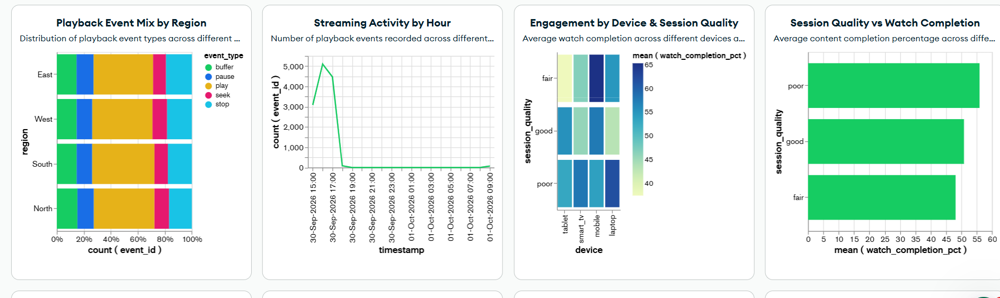
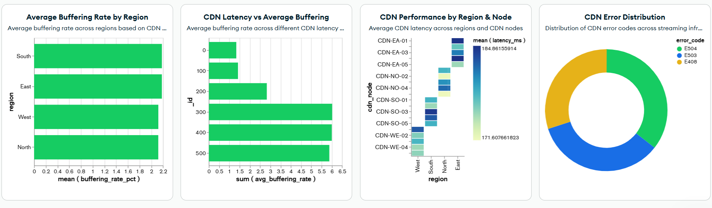
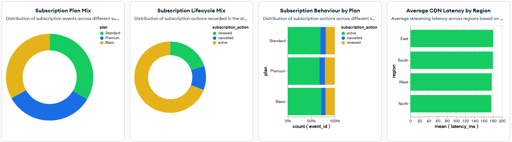

# Streaming Analytics Dashboard

## Dashboard Tool
MongoDB Atlas Charts

## Dashboard Overview
The dashboard analyzes streaming data consumed from Kafka and stored in MongoDB Atlas.

## Dashboard Areas
- Content consumption
- Playback behaviour
- Viewer engagement
- Subscription behaviour
- CDN and streaming performance

## Key Visualizations
- Play Starts
- Content Consumption by Title
- Playback Behaviour Mix
- Average Watch Completion by Title
- Streaming Activity by Hour
- Subscription Plan Mix
- Session Quality vs Watch Completion
- Content Engagement by Region
- Content Performance Matrix
- Average CDN Latency by Region
- Average Buffering Rate by Region
- CDN Performance by Region & Node
- CDN Latency vs Average Buffering
- CDN Error Distribution
- CDN Error Events
- Total Streaming Events

## Data Source
The dashboard reads processed streaming event data from the MongoDB Atlas collection:
streaming_analytics.streaming_events

## Dashboard Screenshot
The live dashboard screenshot is included in this folder for reference.
## Dashboard Screenshots

The following screenshots show the MongoDB Atlas Charts dashboard and its key visualizations.

### 1. Dashboard Overview

### 2. Content Analytics

### 3. Streaming Quality

### 4. Subscription Analytics
